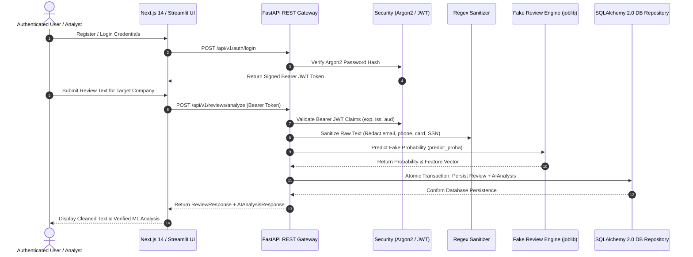

# RitaDrishti-AI — Architecture & System Design Specification

## Overview
**RitaDrishti-AI** is a Trust Intelligence and Risk Auditing Platform. It ingests unstructured review text, applies regex PII sanitization, extracts engineered stylistic features, runs a trained Scikit-Learn Machine Learning Pipeline (`ColumnTransformer` TF-IDF N-grams + 6 style features -> `LogisticRegression`), and persists records atomically in a relational database (`SQLite` / `PostgreSQL` via SQLAlchemy 2.0 and Alembic migrations).

---

## 1. High-Level Architecture

```mermaid
graph TD
    subgraph Client & Presentation Layer
        A1[Next.js 14 App Router UI] --> B[FastAPI Async REST Gateway]
        A2[Streamlit Analytics Dashboard] --> B
    End

    subgraph Security & Data Access Layer
        B --> C[Argon2 Password Hashing & PyJWT Bearer Auth]
        B --> D[Regex PII Sanitizer]
        B --> E[SQLAlchemy 2.0 AsyncSession Repositories]
    End

    subgraph Database Layer
        E --> F1[(SQLite In-Memory / Dev)]
        E --> F2[(PostgreSQL 16 Relational Storage)]
        E --> F3[Alembic Migration Engine]
    End

    subgraph Machine Learning Core
        B --> G1[Fake Review Engine: Scikit-Learn Pipeline]
        B --> G2[Sentiment Engine: VADER Lexicon / Hybrid]
        B --> G3[Trust & Risk Score Calculation Engines]
    End

    subgraph Feature-Gated Optional Extensions
        B -.-> H1[CrewAI Multi-Agent Auditor - ENABLE_CREWAI]
        B -.-> H2[Ollama Llama 3 RAG Copilot - ENABLE_OLLAMA]
        B -.-> H3[Qdrant Vector Database - ENABLE_QDRANT]
        B -.-> H4[Snapdragon NPU Acceleration - ENABLE_NPU]
    End
```

---

## 2. Verified End-to-End Vertical Request Sequence



---

## 3. Subsystem Feature Flags & Guard System

To guarantee that no synthetic responses are returned to users, optional subsystems are guarded by feature flags in `backend/app/config.py`:

```ini
ENABLE_CREWAI=false   # Toggles CrewAI Multi-Agent audit reports
ENABLE_QDRANT=false   # Toggles Qdrant vector database search
ENABLE_OLLAMA=false   # Toggles Ollama Llama 3 RAG AI Copilot
ENABLE_NPU=false      # Toggles Snapdragon NPU hardware acceleration
```

When any of these flags are disabled, endpoints return a structured HTTP `503 Service Unavailable` JSON response with explicit service codes (`CREWAI_DISABLED`, `OLLAMA_DISABLED`, etc.) rather than fallback synthetic text.

---

## 4. Deployment Architecture

```text
+-------------------------------------------------------------------------------+
|                           RitaDrishti-AI Stack                                |
+-------------------------------------------------------------------------------+
|                                                                               |
|   +-----------------------+     +-----------------------+                     |
|   |  Next.js 14 Frontend  | <-> |  FastAPI Gateway API  |                     |
|   |  (Port 3000 Web UI)   |     |  (Port 8000 Engine)   |                     |
|   +-----------------------+     +-----------------------+                     |
|                                             |                                 |
|                                             v                                 |
|                                 +-----------------------+                     |
|                                 |  PostgreSQL 16 DB     |                     |
|                                 | (Alembic Migrations)  |                     |
|                                 +-----------------------+                     |
+-------------------------------------------------------------------------------+
```
