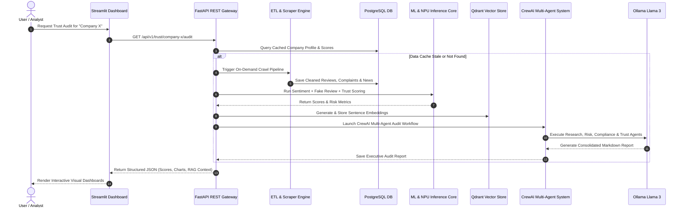

# RitaDrishti-AI — Enterprise Architecture & System Design Specification

## Overview
**RitaDrishti-AI** is an enterprise-grade, AI-powered Trust Intelligence and Risk Intelligence Platform. It aggregates unstructured public reviews, consumer complaints, news articles, and OSINT signals across digital channels, converts them into high-dimensional embeddings and structured features, and applies ML classification, sentiment analysis, fake review detection, multi-agent AI auditing (CrewAI), and Retrieval-Augmented Generation (RAG) to produce real-time Trust Scores and Risk Indexes.

---

## 1. High-Level Architecture

### Architecture Pattern: Event-Driven Modular Microservices Architecture

```mermaid
graph TD
    subgraph Data Collection & Ingestion Layer
        A1[Scrapy Reviews Spider] --> B[ETL Ingestion & Cleaning Pipeline]
        A2[Playwright Complaints Scraper] --> B
        A3[RSS & News Extractor] --> B
    End

    subgraph Data & Storage Layer
        B --> C[(PostgreSQL 18 - Relational Data)]
        B --> D[(Qdrant / FAISS - Vector Index)]
    End

    subgraph AI/ML & Core Analytics Engines
        C --> E1[DistilBERT / VADER Sentiment Engine]
        C --> E2[XGBoost / LightGBM Fake Review Classifier]
        C --> E3[Multi-Factor Trust Score Engine]
        C --> E4[Isolation Forest Risk Prediction Engine]
        E1 & E2 & E3 & E4 --> E5[ONNX / Qualcomm Snapdragon NPU Accelerator]
    End

    subgraph RAG & Multi-Agent Intelligence Layer
        D & C --> F[Ollama Llama3 RAG Engine]
        C --> G[CrewAI Multi-Agent Auditor]
        G --> G1[Research Agent]
        G --> G2[Risk Agent]
        G --> G3[Compliance Agent]
        G --> G4[Trust Agent]
        G --> G5[Report Agent]
    End

    subgraph Enterprise API & Presentation Layer
        E5 & F & G --> H[FastAPI Async REST API Gateway]
        H --> I[Streamlit Multi-Page Dashboard]
        H --> J[External Enterprise Clients / Mobile Apps]
    End
```

### Architectural Justification:
* **Why it is needed**: Trust analysis requires handling continuous, high-volume unstructured text, batch background scrapers, real-time ML inference, vector search, and complex multi-agent reasoning without blocking user-facing dashboards.
* **Advantages**: Decouples data scraping from interactive dashboards; ensures low-latency REST API responses; allows targeted scaling of computationally heavy AI workers independently of the web server.
* **Limitations**: Higher operational complexity than a basic monolingual monolith; requires database synchronization between relational PostgreSQL records and Qdrant vector collections.
* **Scalability Considerations**: Horizontal scaling of FastAPI workers using Uvicorn/Gunicorn; independent scaling of background scraping queues via Celery/Redis; horizontal sharding of Qdrant vector search clusters.

---

## 2. Low-Level Architecture

### Detailed Request & Processing Flow



### Component Justification:
* **Why it is needed**: Ensures predictable request lifecycles, clear error handling, asynchronous non-blocking DB operations (`asyncpg`), and robust fallback mechanisms if external scraping or LLM calls encounter rate limits.
* **Advantages**: Fast read queries from PostgreSQL caching layer ($< 50\text{ ms}$ response times); complete execution trace visibility across agents.
* **Limitations**: Cold-start latency ($5-12\text{ s}$) when running live multi-agent CrewAI audits on un-cached targets.
* **Scalability Considerations**: Asynchronous background task execution (`BackgroundTasks` in FastAPI or Celery tasks) returns instant task IDs so frontend clients poll status without HTTP timeouts.

---

## 3. Data Flow Diagram (DFD)

### Level 1 Data Flow Architecture

```text
[ External Data Sources ] 
(Trustpilot, Consumer Complaints, News Feeds)
          │
          ▼ (Raw Unstructured HTML/JSON)
┌─────────────────────────────────────────┐
│     Process 1.0: Ingestion & ETL       │ ──> [ Raw Text Storage / Temp Cache ]
└─────────────────────────────────────────┘
          │ (Cleaned Text, PII Stripped, Normalized Data)
          ▼
┌─────────────────────────────────────────┐
│  Process 2.0: ML Feature & Sentiment    │ <───> [ PostgreSQL DB: reviews, news, complaints ]
└─────────────────────────────────────────┘
          │ (Sentiment Scores, Fraud Probabilities, Anomaly Signals)
          ▼
┌─────────────────────────────────────────┐
│     Process 3.0: Trust Score Engine     │ ───> [ PostgreSQL DB: trust_scores, risk_scores ]
└─────────────────────────────────────────┘
          │ (Score Aggregations)
          ├──────────────────────────────────────┐
          ▼                                      ▼
┌───────────────────────────────────┐  ┌───────────────────────────────────┐
│ Process 4.0: Embedding & Vector   │  │ Process 5.0: Multi-Agent Crew AI  │
│          Search Indexing          │  │       Executive Auditor           │
└───────────────────────────────────┘  └───────────────────────────────────┘
          │ (Vector Embeddings)                  │ (Structured Executive Reports)
          ▼                                      ▼
┌───────────────────────────────────────────────────────────────────────────┐
│                [ Qdrant Vector DB ] & [ PostgreSQL DB ]                  │
└───────────────────────────────────────────────────────────────────────────┘
          │                                      │
          └──────────────────┬───────────────────┘
                             ▼
┌─────────────────────────────────────────┐
│ Process 6.0: API Serving & RAG Copilot │ ───> [ Streamlit Web UI / End User ]
└─────────────────────────────────────────┘
```

### Data Flow Justification:
* **Why it is needed**: Establishes strict data boundaries, ensuring raw web data passes through validation, PII redaction, and sentiment classification before entering vector search collections or LLM prompt contexts.
* **Advantages**: Guarantees clean, sanitized inputs for LLM prompt injection prevention; enables reproducible audit trails.
* **Limitations**: Pipeline latency depends on input text volume.
* **Scalability Considerations**: Batch chunking of embeddings (e.g., 64 texts per batch) maximizes GPU/NPU utilization.

---

## 4. Component Diagram

```text
+-----------------------------------------------------------------------------------+
|                            RitaDrishti-AI PLATFORM                            |
+-----------------------------------------------------------------------------------+
|                                                                                   |
|   +-----------------------+     +-----------------------+     +---------------+   |
|   |   Streamlit UI App    | <-> |  FastAPI Gateway API  | <-> | SQLAlchemy DB |   |
|   | (Multipage Dashboard) |     |  (REST Router & Auth) |     | (Async Engine)|   |
|   +-----------------------+     +-----------------------+     +---------------+   |
|                                             |                         |           |
|                 +---------------------------+                         |           |
|                 |                           |                         |           |
|                 v                           v                         v           |
|   +-----------------------+     +-----------------------+     +---------------+   |
|   |   Ingestion Engine    |     |    AI/ML Analytics    |     | PostgreSQL 18 |   |
|   |  (Scrapy/Playwright)  |     | (Sentiment/XGBoost)   |     | (Relational)  |   |
|   +-----------------------+     +-----------------------+     +---------------+   |
|                                             |                         |           |
|                                             v                         |           |
|                                 +-----------------------+             |           |
|                                 | Snapdragon NPU Engine |             |           |
|                                 | (ONNX DirectML/QNN)   |             |           |
|                                 +-----------------------+             |           |
|                                             |                         |           |
|                 +---------------------------+                         v           |
|                 |                                             +---------------+   |
|                 v                                             | Qdrant Vector |   |
|   +-----------------------------------------------------+     |  (HNSW Index) |   |
|   |             RAG & Multi-Agent Engine                | <-> +---------------+   |
|   | (CrewAI Agents + Ollama Llama 3 LLM Retrieval)      |                         |
|   +-----------------------------------------------------+                         |
+-----------------------------------------------------------------------------------+
```

---

## 5. Deployment Architecture

### Hybrid Cloud & Edge NPU Architecture

```text
[ Cloud / On-Prem Kubernetes Cluster ]
┌──────────────────────────────────────────────────────────────────────────────────┐
│                                                                                  │
│   ┌─────────────────────┐   ┌─────────────────────┐   ┌──────────────────────┐   │
│   │  FastAPI Pod (x2)   │   │ Streamlit Dashboard │   │ Celery Scraper Queue │   │
│   │ (Port 8000 Engine)  │   │  (Port 8501 UI)     │   │   (Worker Nodes)     │   │
│   └──────────┬──────────┘   └──────────┬──────────┘   └──────────┬───────────┘   │
│              │                         │                         │               │
│              └─────────────────────────┼─────────────────────────┘               │
│                                        ▼                                         │
│   ┌─────────────────────┐   ┌─────────────────────┐   ┌──────────────────────┐   │
│   │  PostgreSQL 18 DB   │   │  Qdrant Vector DB   │   │ Ollama LLM Service   │   │
│   │  (Persistent Vol)   │   │  (HNSW Collection)  │   │   (Llama3 Model)     │   │
│   └─────────────────────┘   └─────────────────────┘   └──────────────────────┘   │
│                                                                                  │
└──────────────────────────────────────────────────────────────────────────────────┘

[ Edge NPU Deployment (Snapdragon X Elite / Copilot+ PC) ]
┌──────────────────────────────────────────────────────────────────────────────────┐
│                                                                                  │
│   ┌──────────────────────────────────────────────────────────────────────────┐   │
│   │ ONNX Runtime Engine with DirectML / Qualcomm QNN Execution Provider      │   │
│   │ -> Local Low-Power Inference for Sentiment & Fraud Scoring on NPU (~45 TOPS)│   │
│   └──────────────────────────────────────────────────────────────────────────┘   │
│                                                                                  │
└──────────────────────────────────────────────────────────────────────────────────┘
```

### Deployment Justification:
* **Why it is needed**: Provides enterprise scalability in cloud environments (Docker/K8s) while simultaneously supporting low-power, zero-latency local NPU execution on Snapdragon-powered Copilot+ PCs.
* **Advantages**: Zero cloud token costs when leveraging local NPU inference for sentiment & local LLMs; high resilience against network disconnects.
* **Limitations**: NPU acceleration requires compilation of PyTorch models into ONNX format with quantized FP16/INT8 precision.
* **Scalability Considerations**: Enables hybrid split execution — routine ML scoring runs on edge NPUs, while heavy batch multi-agent CrewAI runs on scalable cloud nodes.
